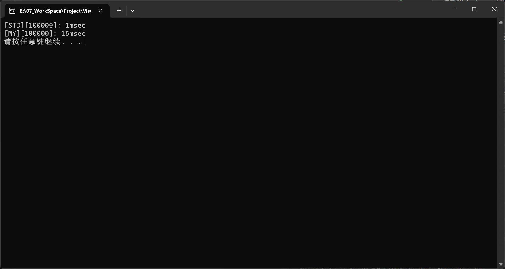
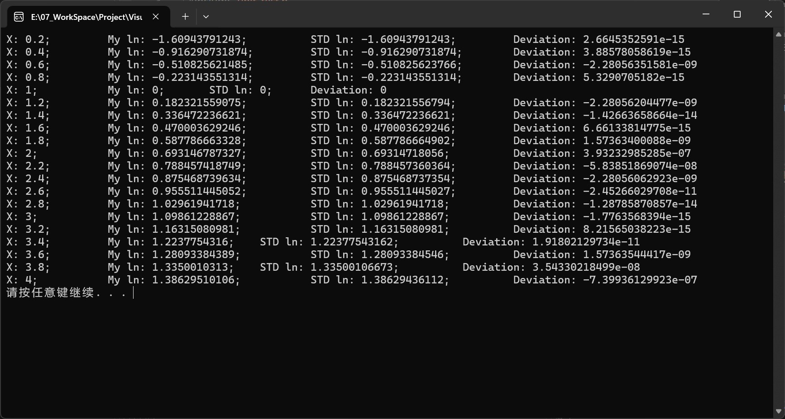

# Solving Logarithmic Functions Using Taylor Series in Computer Programs

## I. Taylor Expansion of the Natural Logarithm Function

$$
\text{Taylor Series:} \quad \sum_{n=0}^{\infty}\frac{f^{(n)}(a)}{n!}(x-a)^n
\\\\
\text{Taylor expansion of } f(x)=\ln(x) \quad (a=1) \text{ yields}
\\\\
\Rightarrow \frac{f^{(0)}(1)}{0!}(x-1)^0+\frac{f^{(1)}(1)}{1!}(x-1)^1+\frac{f^{(2)}(1)}{2!}(x-1)^2+\cdots+\frac{f^{(n)}(1)}{n!}(x-1)^n
\\\\
\Rightarrow 0+(x-1)+(-\frac{1}{2})(x-1)^2+(\frac{2}{2\times3})(x-1)^3+(-\frac{6}{2\times3\times4})(x-1)^4+\cdots
\\\\
\Rightarrow \frac{(x-1)^1}{1}-\frac{(x-1)^2}{2}+\frac{(x-1)^3}{3}-\frac{(x-1)^4}{4}+\cdots
\\\\
\Rightarrow \sum_{n=1}^{\infty}(-1)^{n-1}\frac{(x-1)^n}{n}
$$

## II. Discussion on the Precision of the Taylor Expansion Solution for the Natural Logarithm Function

For the same independent variable $x$, two factors affect the precision of the result after Taylor expansion:

1. The number of terms in the Taylor expansion. More terms lead to higher precision.
2. The absolute value of the difference between the independent variable $x$ and $a$ (here $a=1$), denoted as $D$. A smaller $D$, meaning $x$ is closer to $a$, results in higher precision.

$$
\text{Properties of the Logarithmic Function}
\\
\ln(a\cdot b)=\ln(a)+\ln(b)
\\
\ln(a^b)=b\cdot \ln(a)
$$

For any $x$ within the domain of the logarithmic function $(0,+\infty)$, standardizing the variable to a neighborhood of 1 using the above properties yields more accurate results.
For example: With the same number of expansion terms, directly solving $\ln(2)$ via Taylor expansion is less accurate than solving $4\ln(2^{\frac{1}{4}})$.

## III. Independent Variable as a Floating-Point Number

For a floating-point number, use $s$ for its sign bit, $j$ for its exponent, and $m$ for its mantissa.
From its storage format, we have for a single-precision floating-point number (default is single-precision below)
$$
F32=(-1)^s\times m\times 2^{(j-127)}
$$
or for a double-precision floating-point number
$$
F64=(-1)^s\times m\times 2^{(j-1023)}
$$
Since the domain of the logarithmic function is $(0,+\infty)$, $s$ is always 0, i.e.,
$$
F=m\times 2^{(j-127)}
$$
Thus, solving the logarithmic function with a floating-point number as the independent variable is as follows
$$
\ln(F)=\ln(m\times 2^{(j-127)})
\\
=\ln(m)+\ln(2^{(j-127)})
\\
=\ln(m)+(j-127)\times \ln(2)
$$
Now we need to standardize $m\in[1,2)$ to bring it closer to 1, thereby increasing computational precision.

<p><b><center>【Method One】</center></b></p>

$$
\ln\left(\frac{3}{2}\cdot\frac{2}{3}\cdot m\right)=\ln(3)-\ln(2)+\ln\left(\frac{2}{3}m\right)
\\\\
\because m\in[1,2)
\\\\
\therefore \frac{2}{3}m\in\left([\frac{2}{3},\frac{4}{3})\approx[0.666,1.333)\right)
\\\\
\ln(F)=\ln(3)-\ln(2)+(j-127)\times \ln(2)+\ln\left(\frac{2}{3}m\right)
\\
\text{where } \ln(2), \ln(3) \text{ are constants, and } (j-127) \text{ is the floating-point exponent bias.}
\\
\text{Thus, only } \ln(\frac{2}{3}m) \text{ needs to be summed via Taylor expansion.}
\\\\
\ast \text{ Deviation: } 0.6667 \ \ast
$$

<p><b><center>【Method Two】</center></b></p>

$$
\ln\left(\sqrt{2}\cdot\frac{\sqrt{2}}{2}\cdot m\right)=\frac{1}{2}\ln(2)+\ln\left(\frac{\sqrt{2}}{2}m\right)
\\\\
\because m\in[1,2)
\\\\
\therefore \frac{\sqrt{2}}{2}m\in\left([\frac{\sqrt{2}}{2},\sqrt{2})\approx[0.707,1.414)\right)
\\\\
\ln(F)=\frac{1}{2}\ln(2)+(j-127)\times \ln(2)+\ln\left(\frac{\sqrt{2}}{2}m\right)
\\
\text{where } \ln(2) \text{ is a constant, and } (j-127) \text{ is the floating-point exponent bias.}
\\
\text{Thus, only } \ln(\frac{\sqrt{2}}{2}m) \text{ needs to be summed via Taylor expansion.}
\\\\
\ast \text{ Deviation: } 0.7071 \ \ast
$$

## IV. Solving for $\ln(2)$ and $\ln(3)$

The constants $\ln(2)$ and $\ln(3)$ used above can both be solved by standardizing to a neighborhood of 1 and applying Taylor expansion.

In the code implementation below, the functions *ln2ByTaylorSeries()* and *ln3ByTaylorSeries()* standardize 2 and 3 to a neighborhood of 1 via the following method.
$$
--\ln(2)--
\\\\
\because \ln(2^\frac{1}{16})=\frac{1}{16}\ln(2)
\\
\therefore \ln(2)=16\ln(2^\frac{1}{16})
\\
\ast \quad 2-1=1, \quad \sqrt[16]{2}-1\approx 0.0442737 \quad \ast
\\\\
--\ln(3)--
\\\\
\because \ln(3^\frac{1}{16})=\frac{1}{16}\ln(3)
\\
\therefore \ln(3)=16\ln(3^\frac{1}{16})
\\
\ast \quad 3-1=2, \quad \sqrt[16]{3}-1\approx 0.0710754 \quad \ast
$$

## V. Code Implementation

```cpp
#include <cmath>
#include <exception>

namespace My
{

/*
$$
\because ln(2^\frac{1}{16})=\frac{1}{16}ln(2)
\\
\therefore ln(2)=16ln(2^\frac{1}{16})
\\
\ast \quad 2-1=1, \ \sqrt[16]{2}-1\approx 0.0442737 \quad \ast
$$
*/
// @brief Compute the ln(2) by Taylor series.
// @param series The series larger, result more precise, but no obvious effects if the series over 7 places.
inline double ln2ByTaylorSeries(int series = 1'000'000) {
    double sum = 0;
    double x = std::pow(2, 0.0625) - 1;
    for (int i = 1; i <= series; ++i) {
        if (i % 2 == 0)
            sum -= std::pow(x, i) / i;
        else
            sum += std::pow(x, i) / i;
    }
    return 16 * sum;
}

/*
$$
\because ln(3^\frac{1}{16})=\frac{1}{16}ln(3)
\\
\therefore ln(3)=16ln(3^\frac{1}{16})
\\
\ast \quad 3-1=2, \ \sqrt[16]{3}-1\approx 0.0710754 \quad \ast
$$
*/
// @brief Compute the ln(2) by Taylor series.
// @param series The series larger, result more precise, but no obvious effects if the series over 7 places.
inline double ln3ByTaylorSeries(int series = 1'000'000) {
    double sum = 0;
    double x = std::pow(3, 0.0625) - 1;
    for (int i = 1; i <= series; ++i) {
        if (i % 2 == 0)
            sum -= std::pow(x, i) / i;
        else
            sum += std::pow(x, i) / i;
    }
    return 16 * sum;
}

const double Ln2 = ln2ByTaylorSeries();
const double Ln3 = ln3ByTaylorSeries();

// @param series The series larger, result more precise.
// @note The m in range[1,2), 2m/3 in range[2/3, 4/3). Let "x" moer close 1 for higher precision.
inline double ln(double x, int series = 10) {
    if (x <= 0)      // The log() domain of definition is (0, +infty).
        throw std::domain_error("The x must is positive.");
    if (x == 1)    // The ln(1) = 0.
        return 0;
    // Cast the double to unsigned long long for bit operation.
    unsigned long long _x = *reinterpret_cast<unsigned long long *>(&x);
    // Get the float point num's exp.
    int j = _x >> 52;
    // Get the float point num's mantissa. The (unsigned long long(0x3ff0) << 48) is a double it = 1.0.
    _x = unsigned long long(0x3ff0) << 48 ^ (_x << 12 >> 12);
    // Cast the bit operated unsigned long long to double.
    double m = *reinterpret_cast<double *>(&_x);
    // Let "x" more close 1 for higher precision.
    m = 2 * m / 3;
    // The Taylor series expanded summation.
    double sum = 0;
    for (int i = 1; i <= series; ++i) {
        if (i % 2 == 0)
            sum -= std::pow((m - 1), i) / i;
        else
            sum += std::pow((m - 1), i) / i;
    }
    return sum + Ln3 - Ln2 + (j - 1023) * Ln2;
}

// @param series The series larger, result more precise
// @note The m in range[1,2), √2m/2 in range[√2/2, √2). Let x moer close 1 for get higher precision.
inline double ln_(double x, int series = 10) {
    if (x <= 0)
        throw std::domain_error("The x must is positive.");
    if (x == 1)
        return 0;
    unsigned long long _x = *reinterpret_cast<unsigned long long *>(&x);
    int j = _x >> 52;
    _x = unsigned long long(0x3ff0) << 48 ^ (_x << 12 >> 12);
    double m = *reinterpret_cast<double *>(&_x);
    m = std::pow(2, 0.5) * m / 2;
    double sum = 0;
    for (int i = 1; i <= series; ++i) {
        if (i % 2 == 0)
            sum -= std::pow((m - 1), i) / i;
        else
            sum += std::pow((m - 1), i) / i;
    }
    return sum + Ln2 / 2 + (j - 1023) * Ln2;
}

inline double log(double base, double x) {
    if (base == 1)
        throw std::domain_error("The base num can't is 1.");
    return ln(x) / ln(base);
}

}
```

## VI. Test Comparison Code

```cpp
#include <iostream>

inline void logPrecisionCompare(int testCount = 20) {
    std::cout.precision(12);

    double x = 0.0;
    for (int i = 0; i < testCount; ++i) {
        x += 0.2;
        double a1 = MyLog::ln(x);
        double a2 = StdLog::ln(x);

        std::cout << "X: " << x << ";   \t";
        std::cout << "My ln: " << a1 << ";   \t";
        std::cout << "STD ln: " << a2 << ";   \t";
        std::cout << "Deviation: " << a2 - a1 << "\n";
    }
}

inline void logPerformanceCompare(int testCount = 100'000) {
    time_t start = clock();

    double x = 0.25;
    for (int i = 0; i < testCount; ++i)
        StdLog::ln(x++);

    std::cout << "[STD][" << testCount << "]: ";
    std::cout << clock() - start << "msec" << '\n';
    start = clock();

    x = 0.25;
    for (int i = 0; i < testCount; ++i)
        MyLog::ln(x++);

    std::cout << "[MY][" << testCount << "]: ";
    std::cout << clock() - start << "msec" << '\n';
}
```

## VII. Comparison Results





1. In terms of speed, there is a difference of about 15ms at the scale of one hundred thousand iterations. The standard library likely uses constant tables, optimized algorithms, or other faster computation methods.
2. In terms of precision, MyLog achieves an accuracy of at least 7 decimal places.
