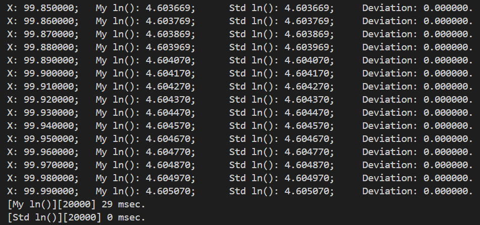

# Solving Logarithmic Functions Using Taylor Series in Computer Programs

[[**简体中文**](./README_CN.md) | **English**]

## Introduction

The logarithmic function is solved through the Taylor series without relying on any third-party libraries or standard mathematics libraries.

## I. Taylor Expansion of the Natural Logarithm Function

$$
\text{Taylor Series:} \quad \sum_{n=0}^{\infty}\frac{f^{(n)}(a)}{n!}(x-a)^n
\\\\
\text{Taylor expansion of } f(x)=\ln(x) \quad (a=1) \text{ yields}
\\\\
\Rightarrow \frac{f^{(0)}(1)}{0!}(x-1)^0+\frac{f^{(1)}(1)}{1!}(x-1)^1+\frac{f^{(2)}(1)}{2!}(x-1)^2+\cdots+\frac{f^{(n)}(1)}{n!}(x-1)^n
\\\\
\Rightarrow 0+(x-1)+(-\frac{1}{2})(x-1)^2+(\frac{2}{2\times3})(x-1)^3+(-\frac{6}{2\times3\times4})(x-1)^4+\cdots
\\\\
\Rightarrow \frac{(x-1)^1}{1}-\frac{(x-1)^2}{2}+\frac{(x-1)^3}{3}-\frac{(x-1)^4}{4}+\cdots
\\\\
\Rightarrow \sum_{n=1}^{\infty}(-1)^{n-1}\frac{(x-1)^n}{n}
$$

## II. Discussion on the Precision of the Taylor Expansion Solution for the Natural Logarithm Function

For the same independent variable $x$, two factors affect the precision of the result after Taylor expansion:

1. The number of terms in the Taylor expansion. More terms lead to higher precision.
2. The absolute value of the difference between the independent variable $x$ and $a$ (here $a=1$), denoted as $D$. A smaller $D$, meaning $x$ is closer to $a$, results in higher precision.

$$
\text{Properties of the Logarithmic Function}
\\
\ln(a\cdot b)=\ln(a)+\ln(b)
\\
\ln(a^b)=b\cdot \ln(a)
$$

For any $x$ within the domain of the logarithmic function $(0,+\infty)$, standardizing the variable to a neighborhood of 1 using the above properties yields more accurate results.
For example: With the same number of expansion terms, directly solving $\ln(2)$ via Taylor expansion is less accurate than solving $4\ln(2^{\frac{1}{4}})$.

## III. Independent Variable as a Floating-Point Number

For a floating-point number, use $s$ for its sign bit, $j$ for its exponent, and $m$ for its mantissa.
From its storage format, we have for a single-precision floating-point number (default is single-precision below)
$$
F32=(-1)^s\times m\times 2^{(j-127)}
$$
or for a double-precision floating-point number
$$
F64=(-1)^s\times m\times 2^{(j-1023)}
$$
Since the domain of the logarithmic function is $(0,+\infty)$, $s$ is always 0, i.e.,
$$
F=m\times 2^{(j-127)}
$$
Thus, solving the logarithmic function with a floating-point number as the independent variable is as follows
$$
\ln(F)=\ln(m\times 2^{(j-127)})
\\
=\ln(m)+\ln(2^{(j-127)})
\\
=\ln(m)+(j-127)\times \ln(2)
$$
Now we need to standardize $m\in[1,2)$ to bring it closer to 1, thereby increasing computational precision.

<p><b><center>【Method One】</center></b></p>

$$
\ln\left(\frac{3}{2}\cdot\frac{2}{3}\cdot m\right)=\ln(3)-\ln(2)+\ln\left(\frac{2}{3}m\right)
\\\\
\because m\in[1,2)
\\\\
\therefore \frac{2}{3}m\in\left([\frac{2}{3},\frac{4}{3})\approx[0.666,1.333)\right)
\\\\
\ln(F)=\ln(3)-\ln(2)+(j-127)\times \ln(2)+\ln\left(\frac{2}{3}m\right)
\\
\text{where } \ln(2), \ln(3) \text{ are constants, and } (j-127) \text{ is the floating-point exponent bias.}
\\
\text{Thus, only } \ln(\frac{2}{3}m) \text{ needs to be summed via Taylor expansion.}
\\\\
\ast \text{ Deviation: } 0.6667 \ \ast
$$

<p><b><center>【Method Two】</center></b></p>

$$
\ln\left(\sqrt{2}\cdot\frac{\sqrt{2}}{2}\cdot m\right)=\frac{1}{2}\ln(2)+\ln\left(\frac{\sqrt{2}}{2}m\right)
\\\\
\because m\in[1,2)
\\\\
\therefore \frac{\sqrt{2}}{2}m\in\left([\frac{\sqrt{2}}{2},\sqrt{2})\approx[0.707,1.414)\right)
\\\\
\ln(F)=\frac{1}{2}\ln(2)+(j-127)\times \ln(2)+\ln\left(\frac{\sqrt{2}}{2}m\right)
\\
\text{where } \ln(2) \text{ is a constant, and } (j-127) \text{ is the floating-point exponent bias.}
\\
\text{Thus, only } \ln(\frac{\sqrt{2}}{2}m) \text{ needs to be summed via Taylor expansion.}
\\\\
\ast \text{ Deviation: } 0.7071 \ \ast
$$

## IV. Solving for $\ln(2)$ and $\ln(3)$

The constants $\ln(2)$ and $\ln(3)$ used above can both be solved by standardizing to a neighborhood of 1 and applying Taylor expansion.

In the code implementation below, the functions *ln2ByTaylorSeries()* and *ln3ByTaylorSeries()* standardize 2 and 3 to a neighborhood of 1 via the following method.
$$
--\ln(2)--
\\\\
\because \ln(2^\frac{1}{16})=\frac{1}{16}\ln(2)
\\
\therefore \ln(2)=16\ln(2^\frac{1}{16})
\\
\ast \quad 2-1=1, \quad \sqrt[16]{2}-1\approx 0.0442737 \quad \ast
\\\\
--\ln(3)--
\\\\
\because \ln(3^\frac{1}{16})=\frac{1}{16}\ln(3)
\\
\therefore \ln(3)=16\ln(3^\frac{1}{16})
\\
\ast \quad 3-1=2, \quad \sqrt[16]{3}-1\approx 0.0710754 \quad \ast
$$

## V. Code Implementation

```c
#include <assert.h> // assert()
#include <string.h> // memcpy()

#define ABS(x) ((x) < 0.0 ? -(x) : (x))

// some precomputed constants.
#define LN2     0.693147180559945309417232121458
#define LN3     1.098612288668109691395245236922
#define SQRT2   1.414213562373095048801688724209

/// @brief Compute integer exponential powers using fast exponentiation.
double my_pow(double x, int exp)
{
    if (exp == 0)
        return 1.0;
    if (exp < 0)
        return 1.0 / my_pow(x, -exp);

    double result = 1.0;
    while (exp)
    {
        if (exp & 1)
            result *= x;
        x *= x;
        exp >>= 1;
    }

    return result;
}

/// @param series The series larger, result more precise.
/// @note The m in range[1,2), 2m/3 in range[2/3, 4/3). Let "x" (see also above document) moer close 1.0 for higher precision.
double my_ln_ver1(double x, int series)
{
    // The ln() domain of definition is (0, +infty).
    assert(x > 0.0);

    // ln(1.0) = 0.0.
    if (x == 1.0)
        return 0.0;

    // Bit-level reinterpretation of double type into unsigned long long type (similar to reinterpret_cast in C++).
    unsigned long long v;
    memcpy(&v, &x, sizeof(v));

    // Get the float point num's exp.
    int j = v >> 52;
    // Get the float point num's mantissa. The (0x3ff0ULL << 48) is a double, it is 1.0.
    v = 0x3ff0ULL << 48 ^ (v << 12 >> 12);

    // Bit-level reinterpretation of unsigned long long type into double type.
    memcpy(&x, &v, sizeof(x));

    // Let "x" more close 1.0 for higher precision.
    // x = 2.0 * x / 3.0;
    x *= 0.666666666666666666666666666666;

    // The Taylor series expanded summation.
    double result = 0.0;
    int sign = 1;
    for (int i = 1; i <= series; ++i)
    {
        result += sign * my_pow((x - 1.0), i) / i;
        sign *= -1;
    }

    return result + LN3 - LN2 + (double) (j - 1023) * LN2;
}

/// @param series The series larger, result more precise.
/// @note The m in range[1,2), √2m/2 in range[√2/2, √2). Let "x" (see also above document) moer close 1.0 for higher precision.
double my_ln_ver2(double x, int series)
{
    assert(x > 0.0);

    if (x == 1.0)
        return 0.0;

    unsigned long long v;
    memcpy(&v, &x, sizeof(v));

    int j = v >> 52;
    v = 0x3ff0ULL << 48 ^ (v << 12 >> 12);

    memcpy(&x, &v, sizeof(x));

    // Let "x" more close 1.0 for higher precision.
    // x = SQRT2 * x / 2.0;
    x *= 0.70710678118654752440084436210485;

    // The Taylor series expanded summation.
    double result = 0.0;
    int sign = 1;
    for (int i = 1; i <= series; ++i)
    {
        result += sign * my_pow((x - 1.0), i) / i;
        sign *= -1;
    }

    return result + LN2 / 2.0 + (double) (j - 1023) * LN2;
}
```

## VI. Test Comparison Code

```c
#include <math.h>   // log() for contrast difference.
#include <time.h>   // time_t, clock()
#include <stdio.h>  // printf()

double std_ln(double x)
{
    return log(x);
}

void benchmark_precision_compare(
    double start, double end, double step,
    double (*my_ln)(double, int), int my_ln_series)
{
    for (; start <= end; start += step)
    {
        double my_ans = my_ln(start, my_ln_series);
        double std_ans = std_ln(start);

        printf("X: %lf;\tMy ln(): %lf;\tStd ln(): %lf;\tDeviation: %lf.\n",
            start, my_ans, std_ans, ABS(my_ans - std_ans));
    }
}

void benchmark_performance_compare(
    double start, double end, double step,
    double (*my_ln)(double, int), int my_ln_series)
{
    int count = (int) ((end - start) / step) + 2;

    // My ln()
    time_t start_time = clock();

    double x = start;
    for (; x <= end; x += step)
        my_ln(x, my_ln_series);

    time_t end_time = clock();
    printf("[My ln()][%d] %ld msec.\n", count, end_time - start_time);

    // Std ln()
    start_time = clock();

    x = start;
    for (; x <= end; x += step)
        std_ln(x);

    end_time = clock();
    printf("[Std ln()][%d] %ld msec.\n", count, end_time - start_time);
}
```

## VII. Comparison Results


